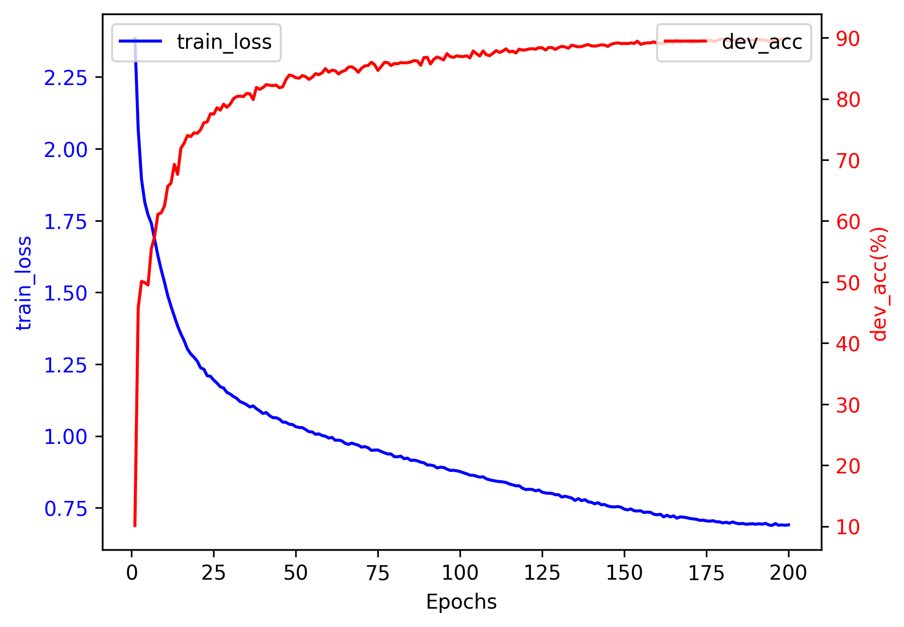

# Self-implemented Vision Transformer
The Vision Transformer (ViT) Paper: ["An Image is Worth 16x16 Words: Transformers for Image Recognition at Scale", Dosovitskiy, A., et. al, (ICLR'21)](https://arxiv.org/pdf/2010.11929)


## Summary of the Paper
### Methodology
Inspired by the Transformer scaling success in NLP, they experiment with applying a standard Transformer directly to images, with the fewest possible modifications. To do so, they split an image into patches and provide the sequence of linear embeddings of these patches as an input to a Transformer. Image patches are treated the same way as tokens (words) in an NLP application. They train the model on image classification in supervised fashion.
### Highlights
Although Transformers lack some of the inductive biases inherent to CNNs, such as translation equivariance and locality, which leads to their relatively poor performance when trained on insufficient amounts of data, the models perform surprisingly well after large-scale training. The resulting Vision Transformer matches or exceeds the state of the art on many image classification datasets, whilst being relatively cheap to pre-train.

## Summary of the Self-implemented Codes
- [ViT Model Implementation](models.py): I implemented the Vision Transformer model architecture from scratch (self-attention, multihead self-attention, transformer layer, and vision transformer block).
- [Trainer Implementation](trainer.py): I implemented the training and testing codes including the plotter.
- During the implementation, I was inspired by https://github.com/omihub777/ViT-CIFAR. I followed their codes to preprocess the CIFAR-10 dataset.

## Experiments
- [LOG](run.log)
### Hyperparameters
|Param|Value|
|:--|:--:|
|n_epochs|200|
|batch_size|128|
|Optimizer|Adam|
|$\beta_1$|0.9|
|$\beta_2$|0.999|
|Weight Decay|5e-5|
|LR Scheduler|Cosine|
|(Init LR, Last LR)|(1e-3, 1e-5)|
|Warmup|5 epochs|
|Dropout|0.0|
|AutoAugment|True|
|Label Smoothing|0.1|
|Heads|12|
|Transformer Layers|7|
|ViT Hidden Dim|384|
|MLP Hidden Dim|384|

### Device
- One NVIDIA RTX A6000 48GB for around 2 hours.

### Results
- #Params: 6,268,810
- Best epoch = 200 with dev_eval acc = 89.87%
- Here is the plot showing the loss curve on the training dataset, and the accuracy curve on the development dataset.
<div style="text-align:center"></div>

## Usage
```
cd KunViT
pip install -r requirements.txt
nohup python -u main.py > run.log 2>&1 &
```